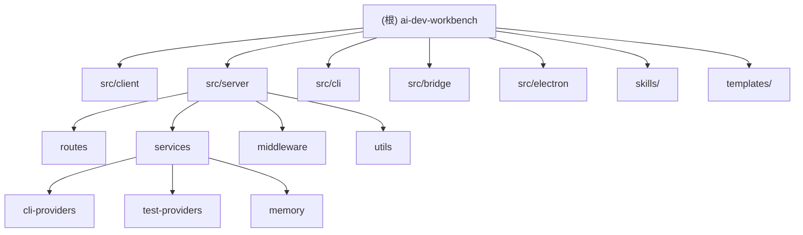

# AI Dev Workbench (adw)

> AI 驱动的开发工作台 -- 集成需求管理、编码、测试，支持 Claude Agent SDK / Codex SDK / MCP 协议。

## 项目愿景

将 AI Agent（Claude / Codex）深度嵌入软件开发的完整工作流：从需求拉取、开发计划生成、代码执行到测试验证，实现端到端的 AI 辅助开发闭环。前端提供可视化操作界面，后端通过 Bridge 进程与 AI CLI 通信，WebSocket 实时推送执行状态。

## 架构总览

- **pnpm workspace monorepo**，`src/` 下按职责分为 `client`、`server`、`cli`、`bridge` 四个顶层模块。
- **前后端分离**：React SPA (Vite) + Express REST API + WebSocket 实时推送。
- **AI 通信层**：`bridge/claude-bridge.mjs` 作为独立子进程，封装 `@anthropic-ai/claude-agent-sdk`，通过 stdin/stdout JSON 行协议与主进程通信。
- **CLI Provider 抽象**：`cli-providers/` 定义统一接口，支持 Claude Code、OpenAI Codex、Pi 三种后端，由 `CLIRunnerService` (Facade) 代理。Claude/Codex 走 SDK 内嵌；Pi 走 RPC 子进程 harness（`pi --mode rpc`，process-per-run，见 `src/server/services/cli-providers/pi-rpc-process.ts` 与计划文档 `docs/plans/2026-07-22-pi-harness-refactor.md`）。
- **平台层**：`src/server/platform/`（引擎无关内核：工具分类/注册表 + MCP 聚合网关），对 Claude 以 HTTP MCP 暴露（`/api/mcp`），对 pi 以 REST 面暴露（`/api/platform`，由 `resources/pi-extensions/adw-platform.ts` 在 pi 子进程内消费）。
- **数据持久化**：文件系统 JSON 存储，位于 `~/.ai-dev-workbench/` 目录下（需求、计划、执行、测试、配置、记忆等）。
- **实时通信**：WebSocket `/ws` 端点 + 服务端 EventBus，广播执行进度、测试输出、Agent 状态等事件。

## 模块结构图



## 模块索引

| 模块 | 路径 | 职责 | 语言 |
|------|------|------|------|
| **client** | `src/client/` | React SPA 前端，页面、组件、状态管理、API 封装 | TSX/TS |
| **server** | `src/server/` | Express 后端，路由、服务层、中间件、工具库 | TS |
| **cli** | `src/cli/` | CLI 入口，端口查找、横幅打印、服务启动 | TS |
| **bridge** | `src/bridge/` | Claude Agent SDK 桥接子进程，stdin/stdout JSON 协议 | MJS |
| **electron** | `src/electron/` | 桌面版 Electron 壳：主进程、服务端子进程引导、GUI PATH 修复 | TS |
| **skills** | `skills/` | 内置 AI 技能模板（SKILL.md），供 Claude 调用 | Markdown |
| **templates** | `templates/` | Excel 模板（任务拆分工时评估） | xlsx |

## 技术栈

| 类别 | 技术 |
|------|------|
| 前端框架 | React 18 + TypeScript |
| 构建工具 | Vite 8 (client) + tsc (server) |
| UI 样式 | Tailwind CSS 3 + Radix UI + Lucide Icons + Framer Motion |
| 状态管理 | Zustand |
| 路由 | React Router v7 |
| 国际化 | i18next + react-i18next |
| 后端框架 | Express 4 |
| 实时通信 | ws (WebSocket) |
| AI SDK | @anthropic-ai/claude-agent-sdk + @openai/codex-sdk |
| MCP | @modelcontextprotocol/sdk |
| 沙箱 | @daytona/sdk |
| 包管理 | pnpm 11 |
| 测试 | Vitest |
| Node 要求 | >= 18.0.0 |

## 运行与开发

```bash
# 安装依赖
pnpm install

# 开发模式（前端 Vite + 后端 tsx，端口 5173/3000）
pnpm dev

# 仅后端开发
pnpm dev:be

# 桌面版开发模式（Vite + tsx 后端 + Electron 壳）
pnpm dev:desktop

# 生产构建
pnpm build

# 桌面版打包（electron-builder，产物 release/）
pnpm dist:win | dist:mac | dist:linux

# 运行测试
pnpm test

# 启动 CLI（生产模式）
pnpm start   # 或 adw
```

**开发模式架构**：Vite 开发服务器 (5173) 代理 `/api/` 和 `/ws` 到后端 (3000)。

**生产模式**：Express 同时提供 API 和前端静态文件，SPA 回退到 `index.html`。

## API 路由总览

| 前缀 | 模块文件 | 主要功能 |
|------|----------|----------|
| `/api/requirements` | `routes/requirements.ts` | 需求 CRUD、agent 中介拉取/搜索（MCP 全量挂载给引擎，零源硬编码）、图片服务 |
| `/api/workspace` | `routes/workspace.ts` | 工作区管理、文件浏览、Git 操作（分支/合并/stash） |
| `/api/plan` | `routes/plan.ts` | 计划生成（AI）、多轮对话、技能队列、任务导出 xlsx |
| `/api/execution` | `routes/execution.ts` | 代码执行（AI）、暂停/中止/重试、自动触发测试 |
| `/api/tests` | `routes/tests.ts` | 测试运行（已有/AI 生成/AI E2E）、沙箱三阶段 |
| `/api/skills` | `routes/skills.ts` | AI 技能 CRUD（内置 + 外部合并） |
| `/api/mcp-servers` | `routes/mcp-servers.ts` | MCP 服务器配置管理 |
| `/api/pipelines` | `routes/pipelines.ts` | 工作流管线配置 |
| `/api/system` | `routes/system.ts` | 系统状态、CLI Provider 选择 |
| `/api/analytics` | `routes/analytics.ts` | 数据分析 |
| `/api/mineru` | `routes/mineru.ts` | MinerU 文档解析 |
| `/api/tasks` | `routes/projects.ts` | 多任务调度管理 |
| `/api/agent-execution` | `routes/agent-execution.ts` | Agent 自主执行（思考/工具调用解析） |
| `/api/model-providers` | `routes/model-providers.ts` | 自定义模型供应商记录（models.json）增删查、检测、导入、拉取模型列表 |
| `/api/prompts` | `routes/prompts.ts` | AI Prompt 优化 |
| `/api/wallpapers` | `routes/wallpapers.ts` | 壁纸库：上传（octet-stream）、媒体流（Range 206）、缩略图、隐藏/删除、设置持久化（`~/.ai-dev-workbench/wallpapers/`） |

## WebSocket 事件

| 事件类型 | 方向 | 说明 |
|----------|------|------|
| `plan:progress` / `plan:complete` | S->C | 计划生成进度 |
| `execution:output` / `execution:complete` | S->C | 执行输出与完成 |
| `test:output` / `test:complete` / `test:phase_change` | S->C | 测试输出与阶段 |
| `agent-execution:*` | S->C | Agent 执行状态/思考/子任务 |
| `task:status_change` / `task:log` | S->C | 多任务状态变更 |
| `requirement:updated` | S->C | 需求更新通知 |
| `error` | S->C | 服务端错误 |

## 测试策略

- **测试框架**：Vitest，配置文件 `vitest.config.ts`
- **测试位置**：与服务文件同目录，命名为 `*.test.ts`
- **已有测试**（17 个）：
  - `cli-runner-service.test.ts` / `cli-providers/pi-provider.test.ts` / `cli-providers/pi-rpc-process.test.ts`
  - `mcp-config-service.test.ts` / `mcp-registry-service.test.ts` / `platform/mcp-gateway.test.ts`
  - `platform/tool-catalog.test.ts` / `platform/tool-registry.test.ts`
  - `requirement-agent-fetch.test.ts`（agent 中介需求拉取/搜索）
  - `workspace-service.test.ts` / `skills-service.test.ts` / `pipeline-service.test.ts`
  - `config-service.test.ts` / `test-executor-service.test.ts` / `hermes-system.test.ts`
  - `sandbox-service.test.ts` / `model-provider-store.test.ts`
- **测试缺失**：路由层、CLI Provider 实现（claude-provider/codex-provider）、bridge、前端组件/页面、agent-coordinator

## 编码规范

- TypeScript strict 模式
- 服务端编译目标 ES2022 + CommonJS
- 前端 JSX react-jsx + noEmit（仅类型检查）
- 模块后缀：`.js`（服务端）/ 无后缀（前端）
- 数据目录统一使用 `~/.ai-dev-workbench/`（常量 `APP_DATA_DIR`）
- Bridge 通信协议：stdin/stdout 逐行 JSON，requestId 关联请求响应

## AI 使用指引

- 修改服务层逻辑时，注意 Facade 模式：`CLIRunnerService` 代理到 `CLIProvider` 实现
- 路由中的异步操作返回后需手动持久化和广播 WebSocket 事件
- `broadcast()` 内部会先经过 `eventBus.dispatch()`，服务端订阅者通过 `eventBus.onEvent()` 监听
- 配置读取统一使用 `ConfigService`，配置文件 `~/.ai-dev-workbench/config.json`
- 持久化层使用文件 JSON 存储，各 Store Service 提供单例或构造实例
- CLI Provider 切换通过 `CLIRunnerService.switchProvider()` 运行时切换

## 变更记录 (Changelog)

| 日期 | 操作 | 说明 |
|------|------|------|
| 2026-09-20 | 更新 | 悬浮快捷设置面板 + 桌面宠物（二期，继续参考 dsh-wallpaper-engine）：① 顶栏调色按钮唤出 FloatingSettingsPanel 右侧悬浮玻璃抽屉（六页签 壁纸/外观/字体/吉祥物/效果/高级，framer-motion 滑动胶囊指示器，页签持久化，非模态可边调边看）；② 外观页签替换原 AppearanceSection：配色（6 预设+自定义取色，applyAccent 覆盖 --brand/--primary/--ring/--bg-glow-*）+ 玻璃颜色（6 预设+自定义+跟随主题，applyGlassColor 覆盖 --glass-*-bg）+ 主题/透明度/背景照片(经典)/语言；③ 字体页签自外观分区迁移（lib/font-options.ts 抽共享）；④ Bongo Cat 桌面宠物：components/mascot/（BongoCat 纯 SVG 打字猫 + useAgentActivity 独立 /ws 连接推导 typing/happy/sad + MascotWidget Web 右下角降级 + PetRoot 宠物窗口分支）+ main.tsx ?pet=1 分支 + Electron 透明置顶不可聚焦悬浮窗（main.ts createPetWindow，IPC adw:set-pet-visible，托盘最小化后宠物仍实时反映任务动态）；⑤ 吉祥物偏好（开/大小/气泡）localStorage 持久化；验证：client+electron tsc 通过、vite build 通过、dist:win 重打包成功（2.4.2） |
| 2026-09-20 | 更新 | 壁纸库功能落地（设计参考 dsh-wallpaper-engine，MIT）：服务端 `WallpaperStoreService` + `/api/wallpapers` 路由（octet-stream 上传 2GB 上限、sendFile Range 206 媒体流、前端 canvas 生成缩略图、软删除隐藏/恢复、设置持久化 `~/.ai-dev-workbench/wallpapers/` 端口无关）；前端 `wallpaper-store`（localStorage 秒开缓存 + 服务端事实源合并、300ms 防抖持久化）+ `WallpaperLayer`（body 下 z:-2 壁纸层 + z:-1 scrim portal，播放意图/元素真实态分离、AbortError 自动补播、换源前 pause+清 src 释放解码器、遮挡暂停三档）；`index.css` 升级 iOS 液态玻璃配方（镜面高光渐变 + 内阴影三件套 + 模糊-饱和度联动 + @supports 近实色回退 + `body[data-wallpaper-active]` 玻璃更透/浅色文字压深/边框增强）；设置中心新增「壁纸」分区（八效果滑杆 accent 填充、胶囊开关、黑胶唱片、倍速/翻转/适配）+ 壁纸选择弹窗（缩略图网格、类型过滤、隐藏恢复、上传自动应用）；中英文案齐备。验证：双端 tsc 通过、vite build 通过、API 全链路冒烟（上传/清单/Range 206/缩略图/设置/隐藏/删除/落盘）通过；vitest 受会话沙箱 spawn 限制未跑（既有测试不导入新模块，无回归影响面） |
| 2026-09-11 | 优化 | 桌面安装包瘦身 252.7→140.9MB：electron-builder files 剔除 AI 引擎平台二进制（@anthropic-ai/claude-agent-sdk-{win32,darwin,linux}-*、@openai/codex-{win32,darwin,linux}-*，约 500MB，BYO-CLI 设计），compression 升 maximum。运行时回退链：claude 桥接 `resolveClaudeCliPath` 增原生安装器（~/.local/bin/claude[.exe]）与 PATH 查找（where/which，仅真实可执行、跳过 .cmd/.ps1 shim）；codex `createClient` 在 SDK 自有平台包全部不可解析时经 `codex-binary.ts`（`getNpmGlobalRoot` execPath 推导优先、npm root -g 兜底；`resolveSystemCodexBinary` 兼容嵌套/平铺 × bin/codex 子布局）定位系统二进制并传 `codexPathOverride`。真机验证：nvm 布局 codex.exe 与原生 claude.exe 均解析成功 |
| 2026-09-11 | 更新 | 桌面版里程碑 1（分支 feat/desktop-electron）：新增 `src/electron/` 模块（Electron 壳，服务端以 ELECTRON_RUN_AS_NODE 子进程启动、GUI PATH 修复、ADW_PORT 端口协调）；`package.json` main 指向 `dist-electron/electron/main.js`，新增 `dev:desktop`/`build:electron`/`dist:win|mac|linux` 脚本；electron-builder 三平台打包（asar:false 保证 pi 扩展真实路径可读）；electron 锁定 39.x。服务链路冒烟通过（SPA 200 + API 200）；测试套件有 8 个预存失败（基线复现，与本变更无关），详见 `docs/plans/2026-09-10-desktop-electron.md` |
| 2026-07-23 | 修复 | 附件面板重定义「解析输入清单」语义（主应用 + 插件内核 store 同步）：只保留 ① 原有真实 http URL 的附件（解析端可按 URL 下载）② 已本地化且被文档引用的（URL 改写为本地地址）；wiki 源整页历史图（无 URL hash 资源）未被文档引用的一律不下载不列出；收集/改写不再要求附件自带 URL（空 URL 的 `[Image:]` 引用也能走 wiki token 下载）；下载失败的标记改写为明示 `[图片未下载：x]` 不再伪造本地链接；占位文本 URL（非 http）视同无 URL。契约 prompt 加「无真实 URL 时省略 url 字段」。实测 CWXT-129290 附件 9→2（文档实际引用数），全部本地 URL |
| 2026-07-23 | 修复 | MCP 注册中心文件格式标准化为 mcpServers 方言（用户反馈自造格式）：`~/.ai-dev-workbench/mcp-servers.json` 读写 `{"mcpServers":{name:{type:"stdio",command,args,env}}}`，停用写 `disabled:true`、非手动导入保留 `source`；兼容读取旧 `{version,servers:[...]}` 并在下次保存自动迁移（真实文件已迁移）；插件内核 mcp-config 补显式 `type`、http 型标准 `headers` 键、`disabled` 读取 |
| 2026-07-23 | 修复 | ONES wiki 图片 0/N 全挂：任务描述里的 wiki 链接是 `/team/{t}/page/{uuid}`（无 space 段），`getWikiPageUuids` 旧正则强制 space 段匹配不到 → 兜底拿任务 UUID 当 wiki 页必 404；放宽路由正则与 ai-dev-requirements 对齐（space 可选 + descriptionText 一并扫描 + URL 解码），主应用与插件内核双份同步；附件本地化范围收敛为图片 + Excel（xls/xlsx/xlsm），其他格式保留源链接不下载；fetch prompt 加"图片标记原样保留"约束（模型压缩正文丢 `[Image:]` 标记）。实测 CWXT-129290：9/9 张图落盘、附件全本地化 |
| 2026-07-23 | 更新 | dsh-adw 插件同步主应用 agent 中介架构（`packages/dsh-adw` 0.4.0 + `packages/adw-requirement-core` 0.3.0）：内核删 per-source 适配器（`requirement-sources` 收敛为中立数据模型 + JSON 契约映射器），新增 `agent-fetch.ts`（AgentLlm 端口 + agent 循环 + 与本体同款 JSON 契约 prompt）；`mcp-bridge.ts` 重写为纯 MCP 传输池（listServerTools/callServerTool，`<server>__<tool>` 前缀路由）；宿主新增 `host/agent-llm.ts`（ctx.llm 适配 + 模型解析：设置项 > agentDefaultModel > 首个 provider），inject 增加 `llm`；路由删 sources 目录/安装端点、客户端收敛为纯 MCP 服务器管理；顺手修复 store `withTimeout` 定时器泄漏 |
| 2026-07-23 | 修复 | pi 引擎 agent 拉取"看不到 MCP 工具"：移除 spawn 的 `--tools` 硬白名单（静默禁用扩展平台工具，主因）；平台扩展工具注册挪到 async factory 顶层（rpc 模式下 `session_start` 注册不进首轮模型工具清单）；网关/扩展冷启动容错（per-server 软超时、降级目录短冷却、空目录重试、白名单定向枚举） |
| 2026-07-23 | 更新 | 需求拉取全面 agent 中介化（`requirement-agent-fetch.ts`，标准 MCP 消费模式）：AI 引擎动态面对已挂载 MCP 工具读 schema 自主调用；删除 per-source 适配器与 `mcp-bridge-service.ts`，新增需求源零代码（配置 MCP server 即可） |
| 2026-07-22 | 更新 | Pi 后端重构为 RPC 子进程 harness（process-per-run + adw 平台扩展）；平台层新增 `/api/platform` REST 面；README.md / README_ZH.md 按真实架构重写（删除虚构的 Agent 系统章节） |
| 2026-07-21 | 创建 | 初始化架构文档，全仓扫描完成 |
