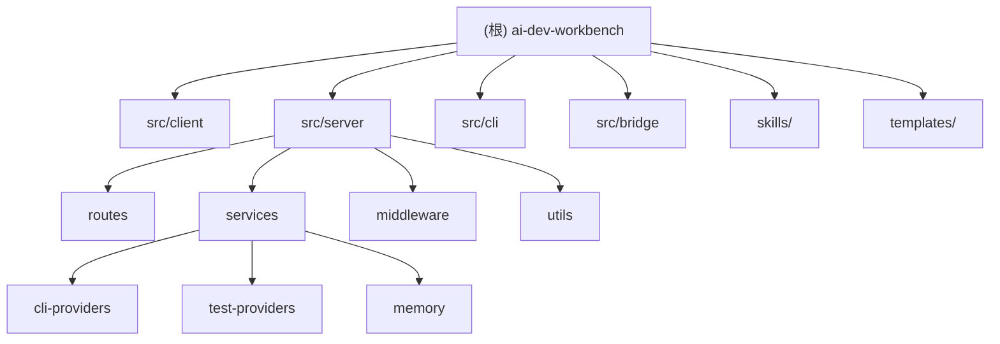

# AI Dev Workbench (adw)

> AI 驱动的开发工作台 -- 集成需求管理、编码、测试，支持 Claude Agent SDK / Codex SDK / MCP 协议。

## 项目愿景

将 AI Agent（Claude / Codex）深度嵌入软件开发的完整工作流：从需求拉取、开发计划生成、代码执行到测试验证，实现端到端的 AI 辅助开发闭环。前端提供可视化操作界面，后端通过 Bridge 进程与 AI CLI 通信，WebSocket 实时推送执行状态。

## 架构总览

- **pnpm workspace monorepo**，`src/` 下按职责分为 `client`、`server`、`cli`、`bridge` 四个顶层模块。
- **前后端分离**：React SPA (Vite) + Express REST API + WebSocket 实时推送。
- **AI 通信层**：`bridge/claude-bridge.mjs` 作为独立子进程，封装 `@anthropic-ai/claude-agent-sdk`，通过 stdin/stdout JSON 行协议与主进程通信。
- **CLI Provider 抽象**：`cli-providers/` 定义统一接口，支持 Claude Code、OpenAI Codex、Pi 三种后端，由 `CLIRunnerService` (Facade) 代理。
- **数据持久化**：文件系统 JSON 存储，位于 `~/.ai-dev-workbench/` 目录下（需求、计划、执行、测试、配置、记忆等）。
- **实时通信**：WebSocket `/ws` 端点 + 服务端 EventBus，广播执行进度、测试输出、Agent 状态等事件。

## 模块结构图



## 模块索引

| 模块 | 路径 | 职责 | 语言 |
|------|------|------|------|
| **client** | `src/client/` | React SPA 前端，页面、组件、状态管理、API 封装 | TSX/TS |
| **server** | `src/server/` | Express 后端，路由、服务层、中间件、工具库 | TS |
| **cli** | `src/cli/` | CLI 入口，端口查找、横幅打印、服务启动 | TS |
| **bridge** | `src/bridge/` | Claude Agent SDK 桥接子进程，stdin/stdout JSON 协议 | MJS |
| **skills** | `skills/` | 内置 AI 技能模板（SKILL.md），供 Claude 调用 | Markdown |
| **templates** | `templates/` | Excel 模板（任务拆分工时评估） | xlsx |

## 技术栈

| 类别 | 技术 |
|------|------|
| 前端框架 | React 18 + TypeScript |
| 构建工具 | Vite 8 (client) + tsc (server) |
| UI 样式 | Tailwind CSS 3 + Radix UI + Lucide Icons + Framer Motion |
| 状态管理 | Zustand |
| 路由 | React Router v7 |
| 国际化 | i18next + react-i18next |
| 后端框架 | Express 4 |
| 实时通信 | ws (WebSocket) |
| AI SDK | @anthropic-ai/claude-agent-sdk + @openai/codex-sdk |
| MCP | @modelcontextprotocol/sdk |
| 沙箱 | @daytona/sdk |
| 包管理 | pnpm 11 |
| 测试 | Vitest |
| Node 要求 | >= 18.0.0 |

## 运行与开发

```bash
# 安装依赖
pnpm install

# 开发模式（前端 Vite + 后端 tsx，端口 5173/3000）
pnpm dev

# 仅后端开发
pnpm dev:be

# 生产构建
pnpm build

# 运行测试
pnpm test

# 启动 CLI（生产模式）
pnpm start   # 或 adw
```

**开发模式架构**：Vite 开发服务器 (5173) 代理 `/api/` 和 `/ws` 到后端 (3000)。

**生产模式**：Express 同时提供 API 和前端静态文件，SPA 回退到 `index.html`。

## API 路由总览

| 前缀 | 模块文件 | 主要功能 |
|------|----------|----------|
| `/api/requirements` | `routes/requirements.ts` | 需求 CRUD、MCP 拉取、搜索、图片服务 |
| `/api/workspace` | `routes/workspace.ts` | 工作区管理、文件浏览、Git 操作（分支/合并/stash） |
| `/api/plan` | `routes/plan.ts` | 计划生成（AI）、多轮对话、技能队列、任务导出 xlsx |
| `/api/execution` | `routes/execution.ts` | 代码执行（AI）、暂停/中止/重试、自动触发测试 |
| `/api/tests` | `routes/tests.ts` | 测试运行（已有/AI 生成/AI E2E）、沙箱三阶段 |
| `/api/skills` | `routes/skills.ts` | AI 技能 CRUD（内置 + 外部合并） |
| `/api/mcp-servers` | `routes/mcp-servers.ts` | MCP 服务器配置管理 |
| `/api/pipelines` | `routes/pipelines.ts` | 工作流管线配置 |
| `/api/system` | `routes/system.ts` | 系统状态、CLI Provider 选择 |
| `/api/analytics` | `routes/analytics.ts` | 数据分析 |
| `/api/mineru` | `routes/mineru.ts` | MinerU 文档解析 |
| `/api/tasks` | `routes/projects.ts` | 多任务调度管理 |
| `/api/agent-execution` | `routes/agent-execution.ts` | Agent 自主执行（思考/工具调用解析） |

## WebSocket 事件

| 事件类型 | 方向 | 说明 |
|----------|------|------|
| `plan:progress` / `plan:complete` | S->C | 计划生成进度 |
| `execution:output` / `execution:complete` | S->C | 执行输出与完成 |
| `test:output` / `test:complete` / `test:phase_change` | S->C | 测试输出与阶段 |
| `agent-execution:*` | S->C | Agent 执行状态/思考/子任务 |
| `task:status_change` / `task:log` | S->C | 多任务状态变更 |
| `requirement:updated` | S->C | 需求更新通知 |
| `error` | S->C | 服务端错误 |

## 测试策略

- **测试框架**：Vitest，配置文件 `vitest.config.ts`
- **测试位置**：与服务文件同目录，命名为 `*.test.ts`
- **已有测试**（10 个）：
  - `cli-runner-service.test.ts`
  - `mcp-config-service.test.ts`
  - `workspace-service.test.ts`
  - `skills-service.test.ts`
  - `pipeline-service.test.ts`
  - `mcp-bridge-service.test.ts`
  - `config-service.test.ts`
  - `test-executor-service.test.ts`
  - `hermes-system.test.ts`
  - `sandbox-service.test.ts`
- **测试缺失**：路由层、CLI Provider 实现（claude-provider/codex-provider）、bridge、前端组件/页面、agent-coordinator

## 编码规范

- TypeScript strict 模式
- 服务端编译目标 ES2022 + CommonJS
- 前端 JSX react-jsx + noEmit（仅类型检查）
- 模块后缀：`.js`（服务端）/ 无后缀（前端）
- 数据目录统一使用 `~/.ai-dev-workbench/`（常量 `APP_DATA_DIR`）
- Bridge 通信协议：stdin/stdout 逐行 JSON，requestId 关联请求响应

## AI 使用指引

- 修改服务层逻辑时，注意 Facade 模式：`CLIRunnerService` 代理到 `CLIProvider` 实现
- 路由中的异步操作返回后需手动持久化和广播 WebSocket 事件
- `broadcast()` 内部会先经过 `eventBus.dispatch()`，服务端订阅者通过 `eventBus.onEvent()` 监听
- 配置读取统一使用 `ConfigService`，配置文件 `~/.ai-dev-workbench/config.json`
- 持久化层使用文件 JSON 存储，各 Store Service 提供单例或构造实例
- CLI Provider 切换通过 `CLIRunnerService.switchProvider()` 运行时切换

## 变更记录 (Changelog)

| 日期 | 操作 | 说明 |
|------|------|------|
| 2026-07-21 | 创建 | 初始化架构文档，全仓扫描完成 |
